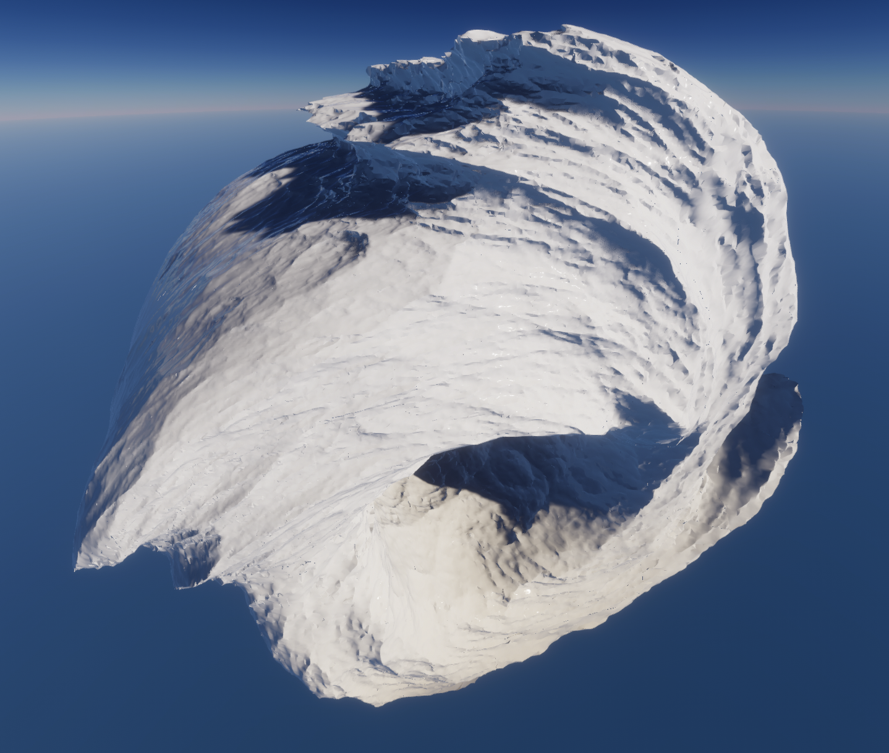
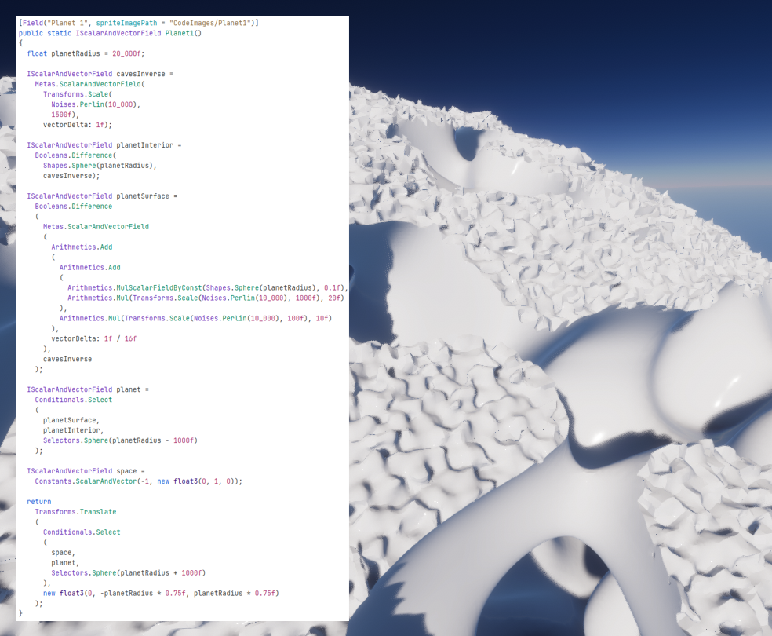

# Isosurface Experiments with Unity, public source

***
## Summary
This is a hobby project where I explored the idea of isosurface visualization in 3d and its potential application to a game or other interactive 3d program.
### Getting the Source Code
**_You will not be able to build this project from the provided source code in this repo._**  
This is intentional at the moment in order to prevent plagiarism. I may decide to release the full source code at a later time.
### Getting the Executable
A build for Windows is [available for download here](https://github.com/ExclusiveOrange/Isosurface-Unity-public/releases). You'll probably want a dedicated GPU but as it's a Unity project it may work on an integrated GPU.
***
## General Idea
### Isosurface
An isosurface is like a manifold which traces out some threshold value in a scalar field. For example a topographic map has elevation lines which are iso*lines* in a 2d scalar field (elevation). In 3d applications an *isosurface* usually means a triangle mesh of some weird shape or planetary surface.  
  
The field used to describe an isosurface can be conveniently defined through the composition of arbitrary math functions. For example a sphere can be defined as the field function:
>field(xyz) = radiusOfSphere - distance(xyz, centerOfSphere)  
  
An isosurface could also be inferred from a discretized field such as a stored grid of field values. Such a grid could be edited in order to edit the isosurface more freely than by editing a math function. _This implementation does not yet support dynamically editable isosurface meshes._
### Method
I based this project on the main idea from the [**Dual Contouring (2001)**](https://www.cs.rice.edu/~jwarren/papers/dualcontour.pdf) paper. I didn't follow their paper exactly, for example I found a more numerically stable solution to vertex location, and my implementation doesn't use adaptive octree subdivision because in this case the field is not a distance field; but overall, their paper is the key to this project.

Dual Contouring is similar to Marching Cubes but instead of placing vertices along grid cell edges, vertices are placed in grid cell interiors. This allows sharp edges / corners in the isosurface to be more accurately approximated, automatically and without having to handle special cases or ambiguities.

In this project the field is represented as a locally differentiable scalar-valued function in 3d. The field is sampled along the points of a regular grid in 3d. For each grid cell edge where an isosurface intersection is detected (where the field value crosses zero), the position along the grid cell edge is refined with a bisection search and then a gradient is measured at that position. Using the main idea of the Dual Contouring method, all the isosurface intersections with a grid cell's edges are used to project a vertex within that cell, which becomes one of the vertices of the triangle mesh of the isosurface.
### Mesh Generation
This application attempts to approximate the isosurface within a large radius in all directions around the camera. The field is sampled at high resolution close-up and lower resolution far-away, such that the angular resolution of a mesh is about the same for near and for far portions of the isosurface.

The isosurface meshes are not stored ahead of time, and are calculated entirely at program run-time. The world is dynamically divided into chunks of different sizes (in an oct-tree) and rendered into triangle meshes using multiple worker threads. The meshes are then rendered to the screen by Unity which takes care of texturing and lighting.
### Unity
I initially considered Unreal Engine as the rendering front-end but ended up using Unity when I discovered that Unity Editor was less prone to crashing and other weird bugs and glitches. Unity's triangle rasterization performance is adequate but the severe performance limitations of Mono C# runtime and even IL2CPP's inadequate performance optimization forced me to eventually rewrite much of this project to use the Unity Burst Compiler, which is a subset of C# that gets compiled to native machine code at runtime by Unity's custom Burst Compiler. Because of the added complexity of having to use Burst to recover the performance lost from using C#, if I had to do it again I would try to write an engine from scratch in C++ using OpenGL directly instead of using Unreal or Unity.
***
## Fields
### Field Representation
In this application scalar fields are defined by composable C# classes, each of which provides some usually simple operation such as arithmetic addition or noise generation or boolean difference. Because the classes are composable, complex looking isosurfaces can be formed with simple composition expressions. Because they are C# classes, this composition can be done in C# without the need for a domain specific language.

### Field Evaluation
Each field class has an internal executable portion representing the operation done by that class. For example the field class corresponding to a _sphere_ field would implement an operation that takes a 3d coordinate as input and returns a scalar value as output.

Before a field is evaluated, its composition expression is compiled into a program that runs on a simple stack machine implemented in this project. Such a program is similar in concept to a shader program. That program is then executed thousands of times per world chunk as the Dual Countouring algorithm evaluates the field value in different locations within the chunk.